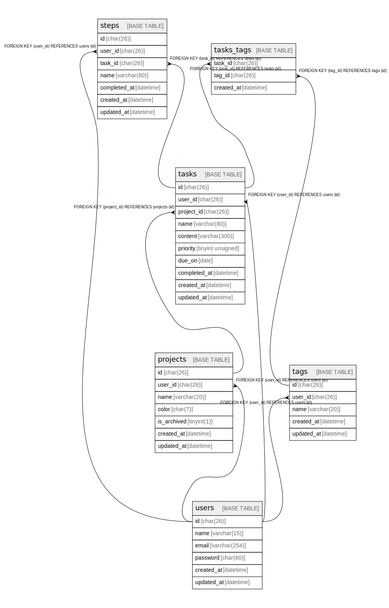

# simoomdb

## Tables

| Name | Columns | Comment | Type |
| ---- | ------- | ------- | ---- |
| [projects](projects.md) | 7 | プロジェクト | BASE TABLE |
| [steps](steps.md) | 7 | ステップ | BASE TABLE |
| [tags](tags.md) | 5 | タグ | BASE TABLE |
| [tasks](tasks.md) | 10 | タスク | BASE TABLE |
| [tasks_tags](tasks_tags.md) | 3 | タスクとタグの紐づき | BASE TABLE |
| [users](users.md) | 6 | ユーザ | BASE TABLE |

## Relations

---

> Generated by [tbls](https://github.com/k1LoW/tbls)
