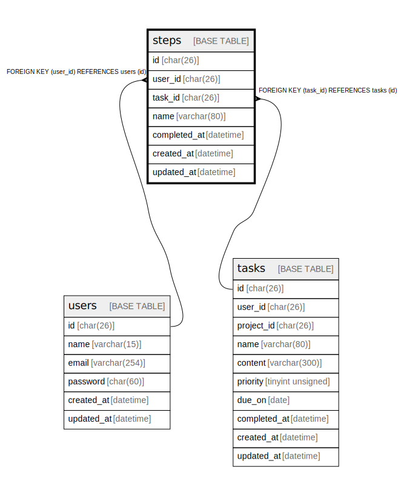

# steps

## Description

ステップ

<details>
<summary><strong>Table Definition</strong></summary>

```sql
CREATE TABLE `steps` (
  `id` char(26) COLLATE utf8mb4_bin NOT NULL COMMENT 'ステップID',
  `user_id` char(26) COLLATE utf8mb4_bin NOT NULL COMMENT '所有するユーザのID',
  `task_id` char(26) COLLATE utf8mb4_bin NOT NULL COMMENT '紐づくタスクのID',
  `title` varchar(80) COLLATE utf8mb4_bin NOT NULL COMMENT 'タイトル',
  `completed_at` datetime DEFAULT NULL COMMENT '完了日',
  `created_at` datetime NOT NULL COMMENT '作成日',
  `updated_at` datetime NOT NULL COMMENT '更新日',
  PRIMARY KEY (`id`),
  KEY `steps_user_id_fk` (`user_id`),
  KEY `steps_task_id_fk` (`task_id`),
  CONSTRAINT `steps_task_id_fk` FOREIGN KEY (`task_id`) REFERENCES `tasks` (`id`) ON DELETE CASCADE ON UPDATE CASCADE,
  CONSTRAINT `steps_user_id_fk` FOREIGN KEY (`user_id`) REFERENCES `users` (`id`) ON DELETE CASCADE ON UPDATE CASCADE
) ENGINE=InnoDB DEFAULT CHARSET=utf8mb4 COLLATE=utf8mb4_bin COMMENT='ステップ'
```

</details>

## Columns

| Name | Type | Default | Nullable | Children | Parents | Comment |
| ---- | ---- | ------- | -------- | -------- | ------- | ------- |
| id | char(26) |  | false |  |  | ステップID |
| user_id | char(26) |  | false |  | [users](users.md) | 所有するユーザのID |
| task_id | char(26) |  | false |  | [tasks](tasks.md) | 紐づくタスクのID |
| title | varchar(80) |  | false |  |  | タイトル |
| completed_at | datetime |  | true |  |  | 完了日 |
| created_at | datetime |  | false |  |  | 作成日 |
| updated_at | datetime |  | false |  |  | 更新日 |

## Constraints

| Name | Type | Definition |
| ---- | ---- | ---------- |
| PRIMARY | PRIMARY KEY | PRIMARY KEY (id) |
| steps_task_id_fk | FOREIGN KEY | FOREIGN KEY (task_id) REFERENCES tasks (id) |
| steps_user_id_fk | FOREIGN KEY | FOREIGN KEY (user_id) REFERENCES users (id) |

## Indexes

| Name | Definition |
| ---- | ---------- |
| steps_task_id_fk | KEY steps_task_id_fk (task_id) USING BTREE |
| steps_user_id_fk | KEY steps_user_id_fk (user_id) USING BTREE |
| PRIMARY | PRIMARY KEY (id) USING BTREE |

## Relations



---

> Generated by [tbls](https://github.com/k1LoW/tbls)
