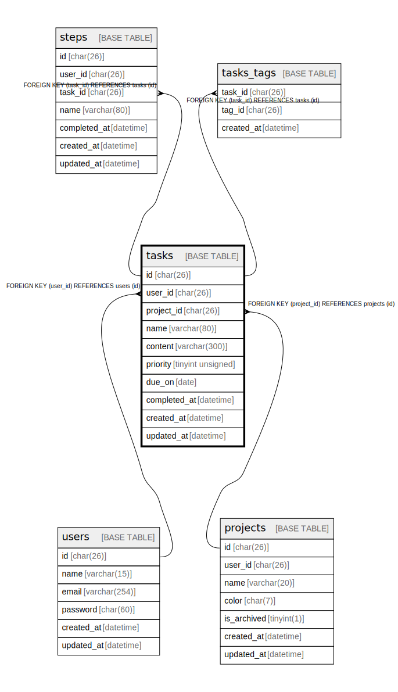

# tasks

## Description

タスク

<details>
<summary><strong>Table Definition</strong></summary>

```sql
CREATE TABLE `tasks` (
  `id` char(26) COLLATE utf8mb4_bin NOT NULL COMMENT 'タスクID',
  `user_id` char(26) COLLATE utf8mb4_bin NOT NULL COMMENT '所有するユーザのID',
  `project_id` char(26) COLLATE utf8mb4_bin NOT NULL COMMENT '紐づくプロジェクトのID',
  `title` varchar(80) COLLATE utf8mb4_bin NOT NULL COMMENT 'タイトル',
  `content` varchar(300) COLLATE utf8mb4_bin NOT NULL COMMENT 'メモ',
  `priority` tinyint unsigned NOT NULL COMMENT '優先度（0~3の数字で指定し、3が最も優先度が高い）',
  `due_on` date DEFAULT NULL COMMENT '期日',
  `completed_at` datetime DEFAULT NULL COMMENT '完了日',
  `created_at` datetime NOT NULL DEFAULT CURRENT_TIMESTAMP COMMENT '作成日',
  `updated_at` datetime NOT NULL DEFAULT CURRENT_TIMESTAMP ON UPDATE CURRENT_TIMESTAMP COMMENT '更新日',
  PRIMARY KEY (`id`),
  KEY `tasks_user_id_fk` (`user_id`),
  KEY `tasks_project_id_fk` (`project_id`),
  CONSTRAINT `tasks_project_id_fk` FOREIGN KEY (`project_id`) REFERENCES `projects` (`id`) ON DELETE CASCADE ON UPDATE CASCADE,
  CONSTRAINT `tasks_user_id_fk` FOREIGN KEY (`user_id`) REFERENCES `users` (`id`) ON DELETE CASCADE ON UPDATE CASCADE,
  CONSTRAINT `tasks_chk_1` CHECK ((`priority` between 0 and 3))
) ENGINE=InnoDB DEFAULT CHARSET=utf8mb4 COLLATE=utf8mb4_bin COMMENT='タスク'
```

</details>

## Columns

| Name | Type | Default | Nullable | Extra Definition | Children | Parents | Comment |
| ---- | ---- | ------- | -------- | ---------------- | -------- | ------- | ------- |
| id | char(26) |  | false |  | [steps](steps.md) [tasks_tags](tasks_tags.md) |  | タスクID |
| user_id | char(26) |  | false |  |  | [users](users.md) | 所有するユーザのID |
| project_id | char(26) |  | false |  |  | [projects](projects.md) | 紐づくプロジェクトのID |
| title | varchar(80) |  | false |  |  |  | タイトル |
| content | varchar(300) |  | false |  |  |  | メモ |
| priority | tinyint unsigned |  | false |  |  |  | 優先度（0~3の数字で指定し、3が最も優先度が高い） |
| due_on | date |  | true |  |  |  | 期日 |
| completed_at | datetime |  | true |  |  |  | 完了日 |
| created_at | datetime | CURRENT_TIMESTAMP | false | DEFAULT_GENERATED |  |  | 作成日 |
| updated_at | datetime | CURRENT_TIMESTAMP | false | DEFAULT_GENERATED on update CURRENT_TIMESTAMP |  |  | 更新日 |

## Constraints

| Name | Type | Definition |
| ---- | ---- | ---------- |
| PRIMARY | PRIMARY KEY | PRIMARY KEY (id) |
| tasks_project_id_fk | FOREIGN KEY | FOREIGN KEY (project_id) REFERENCES projects (id) |
| tasks_user_id_fk | FOREIGN KEY | FOREIGN KEY (user_id) REFERENCES users (id) |
| tasks_chk_1 | CHECK | CHECK ((`priority` between 0 and 3)) |

## Indexes

| Name | Definition |
| ---- | ---------- |
| tasks_project_id_fk | KEY tasks_project_id_fk (project_id) USING BTREE |
| tasks_user_id_fk | KEY tasks_user_id_fk (user_id) USING BTREE |
| PRIMARY | PRIMARY KEY (id) USING BTREE |

## Relations



---

> Generated by [tbls](https://github.com/k1LoW/tbls)
