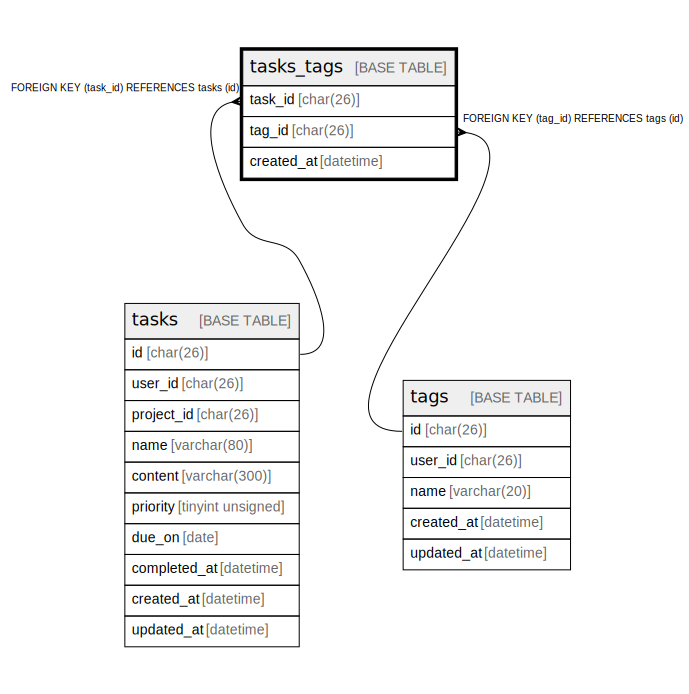

# tasks_tags

## Description

タスクとタグの紐づき

<details>
<summary><strong>Table Definition</strong></summary>

```sql
CREATE TABLE `tasks_tags` (
  `task_id` char(26) COLLATE utf8mb4_bin NOT NULL COMMENT '紐づくタスクID',
  `tag_id` char(26) COLLATE utf8mb4_bin NOT NULL COMMENT '紐づくタグID',
  `created_at` datetime NOT NULL DEFAULT CURRENT_TIMESTAMP COMMENT '作成日',
  PRIMARY KEY (`task_id`,`tag_id`),
  KEY `tasks_tags_tag_id_fk` (`tag_id`),
  CONSTRAINT `tasks_tags_tag_id_fk` FOREIGN KEY (`tag_id`) REFERENCES `tags` (`id`) ON DELETE CASCADE ON UPDATE CASCADE,
  CONSTRAINT `tasks_tags_task_id_fk` FOREIGN KEY (`task_id`) REFERENCES `tasks` (`id`) ON DELETE CASCADE ON UPDATE CASCADE
) ENGINE=InnoDB DEFAULT CHARSET=utf8mb4 COLLATE=utf8mb4_bin COMMENT='タスクとタグの紐づき'
```

</details>

## Columns

| Name | Type | Default | Nullable | Extra Definition | Children | Parents | Comment |
| ---- | ---- | ------- | -------- | ---------------- | -------- | ------- | ------- |
| task_id | char(26) |  | false |  |  | [tasks](tasks.md) | 紐づくタスクID |
| tag_id | char(26) |  | false |  |  | [tags](tags.md) | 紐づくタグID |
| created_at | datetime | CURRENT_TIMESTAMP | false | DEFAULT_GENERATED |  |  | 作成日 |

## Constraints

| Name | Type | Definition |
| ---- | ---- | ---------- |
| PRIMARY | PRIMARY KEY | PRIMARY KEY (task_id, tag_id) |
| tasks_tags_tag_id_fk | FOREIGN KEY | FOREIGN KEY (tag_id) REFERENCES tags (id) |
| tasks_tags_task_id_fk | FOREIGN KEY | FOREIGN KEY (task_id) REFERENCES tasks (id) |

## Indexes

| Name | Definition |
| ---- | ---------- |
| tasks_tags_tag_id_fk | KEY tasks_tags_tag_id_fk (tag_id) USING BTREE |
| PRIMARY | PRIMARY KEY (task_id, tag_id) USING BTREE |

## Relations



---

> Generated by [tbls](https://github.com/k1LoW/tbls)
